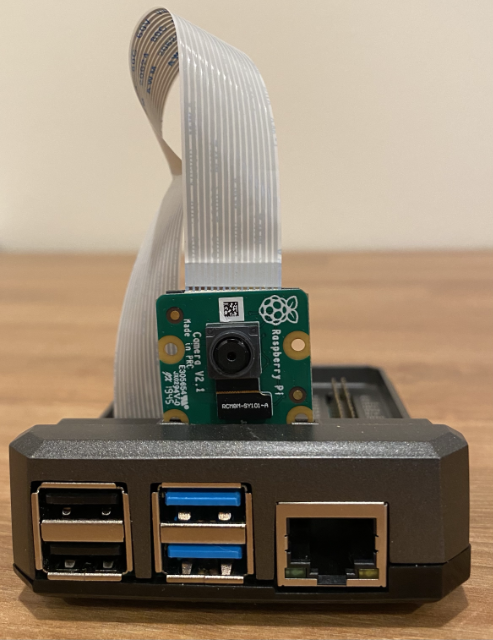
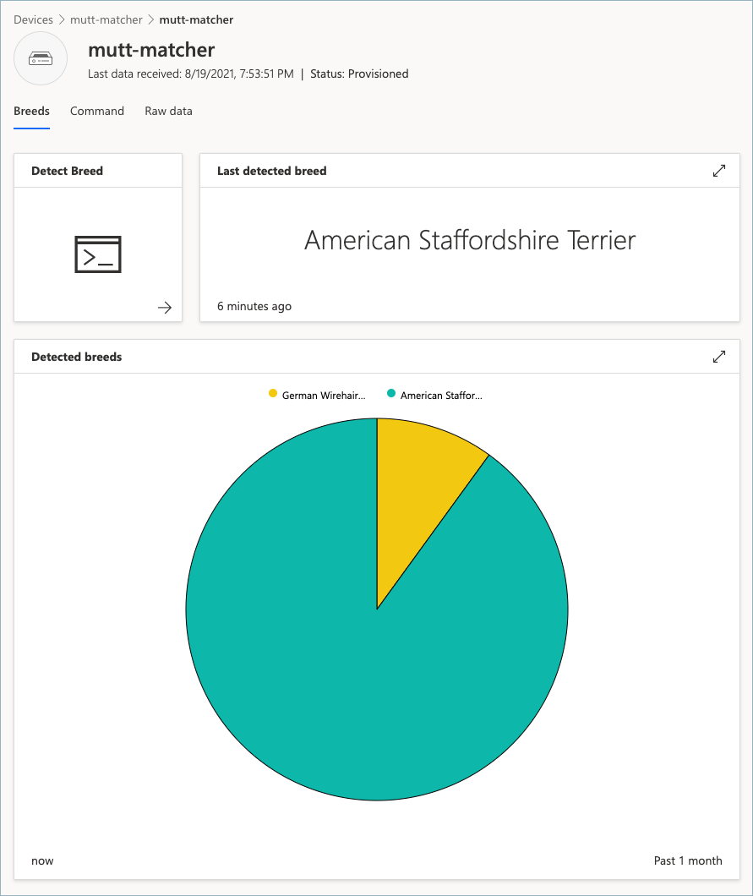
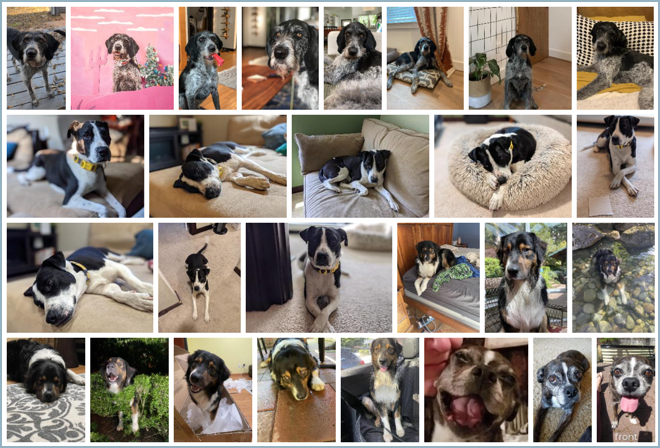
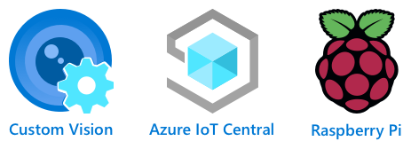
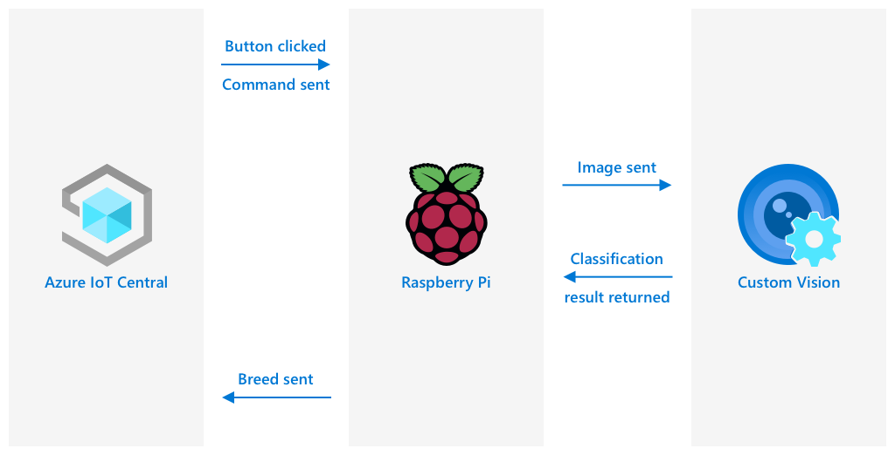

# Scenario: The Mutt Matcher (IoT version)

According to the World Health Organization there are more than 200 million stray dogs worldwide. The American Society for the Prevention of Cruelty to Animals estimates over 3 million dogs enter their shelters annually - about 6 dogs per minute! Anything that can reduce the time and effort to take in strays can potentially help millions of dogs every year.

Different breeds have different needs, or react differently to people, so when a stray or lost dog is found, identifying the breed can be a great help.

Your team has been asked by a fictional animal shelter to build a Mutt Matcher - a device to help determine the breed of a dog when it has been found. This will be an IoT (Internet of Things) device based around a Raspberry Pi with a camera, and will take a photo of the dog, and then use an image classifier Machine learning (ML) model to determine the breed, before uploading the results to a web-based IoT application.

This device will help workers and volunteers to be able to quickly detect the breed and make decisions on the best way to approach and care for the dog.

The animal shelter has provided [a set of images](https://github.com/microsoft/hack-workshop-iot/tree/main/model-images) for a range of dog breeds to get you started. These can be used to train the ML model using a service called Custom Vision.

## Prerequisites

Each team member will need an Azure account. With [Azure for Students](https://azure.microsoft.com/free/students/?WT.mc_id=academic-36256-jabenn), you can access $100 in free credit, and a large suite of free services!

Your team should be familiar with the following:

- Git and GitHub
  - [Forking](https://docs.github.com/github/getting-started-with-github/quickstart/fork-a-repo) and [cloning](https://docs.github.com/github/creating-cloning-and-archiving-repositories/cloning-a-repository-from-github/cloning-a-repository) repositories

- [Python](https://channel9.msdn.com/Series/Intro-to-Python-Development?WT.mc_id=academic-36256-jabenn)

### Hardware

To complete this workshop fully, ideally you will need a [Raspberry Pi (model 3 or 4)](https://www.raspberrypi.org/products/raspberry-pi-4-model-b/), and a camera. The camera can be a [Raspberry Pi Camera module](https://www.raspberrypi.org/products/camera-module-v2/), or a USB web cam.

> 💁 If you don't have a Raspberry Pi, you can run this workshop using a PC or Mac to simulate an IoT device, with either a built in or external webcam.

### Software

Each member of your team will also need the following software installed:

- [Git](https://git-scm.com/downloads)
  - [Install git on macOS](https://git-scm.com/download/mac)
  - [Install git on Windows](https://git-scm.com/download/win)
  - [Install git on Linux](https://git-scm.com/download/linux)

- [Visual Studio Code](https://code.visualstudio.com/?WT.mc_id=academic-36256-jabenn)

## Resources

A series of resources will be provided to help your team determine the appropriate steps for completion. The resources provided should provide your team with enough information to achieve each goal.

These resources include:

- Appropriate links to documentation to learn more about the services you are using and how to do common tasks
- A pre-built application template for the cloud service part of your IoT application
- Full source code for your IoT device

If you get stuck, you can always ask a mentor for additional help.

## Exploring the application

The application your team will build will consist of 3 components:

- An image classifier running in the cloud using Microsoft Custom Vision

- An IoT application running in the cloud using Azure IoT Central

- A Raspberry Pi based IoT device with a camera

When a dog breed needs to be detected:

1. A button on the IoT application is clicked

1. The IoT application sends a command to the IoT device to detect the breed

1. The IoT device captures an image using its camera

1. The image is sent to the image classifier ML model in the cloud to detect the breed

1. The results of the classification are sent back to the IoT device

1. The detected breed is sent from the IoT device to the IoT application

## Goals

Your team will set up the Pi, ML model and IoT application, then connect everything to gether by deploying code to the IoT device.

> 💁 Each goal below defines what you need to achieve, and points you to relevant on-line resources that will show you how the cloud services or tools work. The aim here is not to provide you with detailed steps to complete the task, but allow you to explore the documentation and learn more about the services as you work out how to complete each goal.

0. [Set up your Raspberry Pi and camera](./goals/set-up-pi.md): You will need to set up a clean install of Raspberry Pi OS on your Pi and ensure all the required software is installed.
    > 💻 If you are using a PC or Mac instead of a Pi, your team will need to [set this up instead](./goals/set-up-pc-mac.md).

1. [Train your ML model](./goals/train-model.md): Your team will need to train the ML model in the cloud using Microsoft Custom Vision. You can train and test this model using the images that have been provided by the animal shelter.

2. [Set up your IoT application](./goals/set-up-iot-central.md): Your team will set up an IoT application in the cloud using IoT Central, an IoT software-as-a-service (SaaS) platform. You will be provided with a pre-built application template to use.

3. [Deploy device code to your Pi](./goals/deploy-device-code.md): The code for the IoT device needs to be configured and deployed to the Raspberry Pi. You will then be able to test out your application.

    > 💻 If you are using a PC or Mac instead of a Pi, your team will need to run the device code locally.

> 💁 The first 3 goals can be worked on concurrently, with different team members working on different steps. Once these 3 are completed, the final step can be worked on by the team.

## Validation

This workshop is designed to be a goal-oriented self-exploration of Azure and related technologies. Your team can validate some of the goals using the supplied validation scripts, and instructions are provided where relevant. Your team can then validate the final solution by using the IoT device to take a picture of one of the provided testing images and ensuring the correct result appears in the IoT application.

## Where do we go from here?

This project is designed as a potential seed for ideas and future development during your hackathon. Other hack ideas for similar IoT devices that use image classification include:

- Trash sorting into landfill, recycling, and compost.

- Identification of disease in plant leaves.

- Detecting skin cancer by classification of moles.

Improvements you could make to this device include:

- Adding hardware such as a button to take a photograph, instead of relying on the IoT application.

- Adding a screen or LCD display to the IoT device to show the breed.

- Migrating the image classifier to the edge to allow the device to run without connectivity using [Azure IoT Edge](https://docs.microsoft.com/azure/iot-edge/about-iot-edge?WT.mc_id=academic-36256-jabenn).

### Learn more

You can learn more about using Custom Vision to train image classifiers and object detectors using the following resources:

- [Custom Vision documentation](https://docs.microsoft.com/azure/cognitive-services/custom-vision-service/?WT.mc_id=academic-36256-jabenn)

- [Custom Vision modules on Microsoft Learn, a free, hands-on, self-guided learning platform](https://docs.microsoft.com/users/jimbobbennett/collections/qe2ehjny7z7zgd?WT.mc_id=academic-36256-jabenn)

You can learn more about Azure IoT Central using the following resources:

- [IoT Central documentation](https://docs.microsoft.com/azure/iot-central/?WT.mc_id=academic-36256-jabenn)

- [IoT Central modules on Microsoft Learn, a free, hands-on, self-guided learning platform](https://docs.microsoft.com/users/jimbobbennett/collections/o5w5c3eyre61x7?WT.mc_id=academic-36256-jabenn)

If you enjoy working with IoT, you can learn more using the following resource:

- [IoT for beginners, a 24-lesson curriculum all about IoT basics](https://github.com/microsoft/IoT-For-Beginners)

## Contributing

This project welcomes contributions and suggestions.  Most contributions require you to agree to a
Contributor License Agreement (CLA) declaring that you have the right to, and actually do, grant us
the rights to use your contribution. For details, visit https://cla.opensource.microsoft.com.

When you submit a pull request, a CLA bot will automatically determine whether you need to provide
a CLA and decorate the PR appropriately (e.g., status check, comment). Simply follow the instructions
provided by the bot. You will only need to do this once across all repos using our CLA.

This project has adopted the [Microsoft Open Source Code of Conduct](https://opensource.microsoft.com/codeofconduct/).
For more information see the [Code of Conduct FAQ](https://opensource.microsoft.com/codeofconduct/faq/) or
contact [opencode@microsoft.com](mailto:opencode@microsoft.com) with any additional questions or comments.

## Trademarks

This project may contain trademarks or logos for projects, products, or services. Authorized use of Microsoft
trademarks or logos is subject to and must follow
[Microsoft's Trademark & Brand Guidelines](https://www.microsoft.com/en-us/legal/intellectualproperty/trademarks/usage/general).
Use of Microsoft trademarks or logos in modified versions of this project must not cause confusion or imply Microsoft sponsorship.
Any use of third-party trademarks or logos are subject to those third-party's policies.
