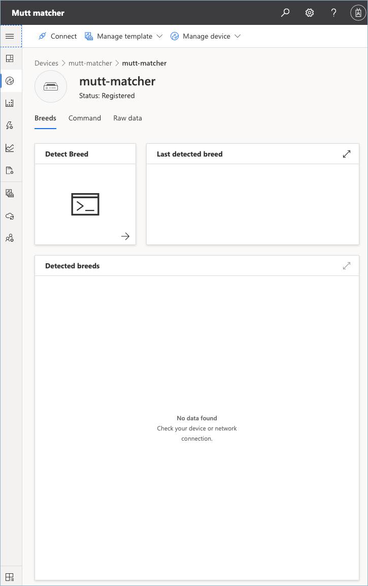

# Goal 2: Set up your IoT application

The Mutt Matcher is an IoT device, so needs to connect to an IoT service in the cloud. IoT stands for *Internet of Things*, and involves *Things* that interact with the physical world, and *Internet* services to work with the things. The IoT service for the Mutt Matcher will control the IoT device - sending commands to the device to take a picture and classify it, store the results of the classification, and make them available on a dashboard.

The goal of this section is to deploy an IoT Central application, and define a device in the application.

## The Azure Service

[](https://azure.microsoft.com/services/iot-central/?WT.mc_id=academic-36256-jabenn)

Azure IoT Central is an IoT software-as-a-service (SaaS) application. You can use it to create an IoT application in the cloud that can manage IoT devices, as well as communicating with those devices. You can use it to define *device templates* that define that telemetry data an IoT device will send, and what commands you can send to that device to control it.

You can then register devices inside the application, ensuring you have control over what physical IoT devices will connect to your IoT application. You can also set up views and dashboards to visualize the data send from your devices.


For this workshop, you will need an IoT application that has a device template for Mutt Matchers, defining a *command* that instructs the device to take a picture and detect the breed, and *telemetry* data that the device will send with the detected breed.

Your application will then need a dashboard to allow you to run the command, as well as see the last detected breed and a history of detected breeds.

Inside your application, you will need to register a device that represents your Raspberry Pi, and this device has connection details that will allow your Raspberry Pi to connect.

## Application template

Rather than build your application and device template from scratch, you can use a pre-built template to help. Select the button below to deploy the application.

[](https://aka.ms/mutt-matcher-iot-central-app)

Set your applications name to `Mutt Matcher`, then set a unique URL, then select a pricing plan.

Once your application has been deployed, you will need to register a new device using the `mutt-matcher` device template that is already defined in the application. You can use this device registration to get connection details for your Mutt Matcher.

When you view the device, you will see a dashboard with a *Detect Breed* button, the last detected breed, and a Pie chart of all the detected breeds. When you select the *Detect Breed* button, it will take you to the *Command* tab in the dashboard where you can run this command.

## Success criteria

Your team will work together to create the IoT application and set up your Mutt Matcher device. Your team will have achieved this goal when the following success criteria is met:

- Your IoT Central application is deployed.
- You have created a device using the `mutt-matcher` device template.
- You have the connection details needed for your IoT device to connect as the created device in the IoT Central application.

## Validation

You can validate that your IoT application has been set up correctly using a Python script inside this repo.

1. You will need an API key for your IoT Central application. To get one, follow the instructions in the [Get an API token documentation](https://docs.microsoft.com/azure/iot-central/core/howto-authorize-rest-api?WT.mc_id=academic-36256-jabenn#get-an-api-token).

1. From wherever you cloned this repo, navigate to the `validation` folder.

1. Create an activate a Python virtual environment. If you've not done this before, you can refer to the [Python creation of virtual environments documentation](https://docs.python.org/3/library/venv.html).

1. Install the Pip packages in the `requirements.txt` file using the following command from inside the activated virtual environment:

    ```sh
    pip install -r requirements.txt
    ```

1. Run the validation script using the following command:

    ```sh
    python validate-iot-application.py
    ```

1. When prompted, enter the API token, and the URL of your application.

This validation script will take the testing images, and test them against the model to ensure the correct tag is found as the most probable. You will see output like the following:

```output
(.venv) ➜  validation git:(main) ✗ python3 validate-iot-application.py
IoT application validation
What is your IoT application API token?
SharedAccessSignature sr=xxxxxxxx-xxxx-xxxx-xxxx-xxxxxxxxxx&sig=xxxxxxxxxxxxxxxxxxxxxxxxxxxxxxxxxxxxxxxxxxxxxxxxxx=Validation&se=1660961122741
What is your application URL?
https://mutt-matcher.azureiotcentral.com/
Connecting as device mutt-matcher
Connected
Command received: DetectBreed
Last detected breed: american-staffordshire-terrier
Validation passed!
```

The validation tool will listen for a command and send back a dog breed. After you run this, you will see a value for the last detected breed and data in the Pie chart on the `mutt-matcher` device dashboard.

## Resources

Your team might find these resources helpful:

- [Use an application template guide in the IoT Central documentation](https://docs.microsoft.com/azure/iot-central/core/howto-create-iot-central-application?WT.mc_id=academic-36256-jabenn#use-an-application-template)
- [Add a device guide in the IoT Central documentation](https://docs.microsoft.com/azure/iot-central/core/howto-manage-devices-individually?WT.mc_id=academic-36256-jabenn#add-a-device)
- [Register a single device in advance guide in the IoT Central documentation](https://docs.microsoft.com/azure/iot-central/core/concepts-get-connected?WT.mc_id=academic-36256-jabenn#register-a-single-device-in-advance)

## Tips

- Make sure you select the `mutt-matcher` device template when registering your new device
- You will only be using one device, so it doesn't matter which pricing plan you use, they will all be free for 1 device.
- The application URL needs to be globally unique, so don't use `mutt-matcher`!

## Final result



## Next challenge

The next goal is to [deploy your code to your an IoT device](./deploy-device-code.md).
